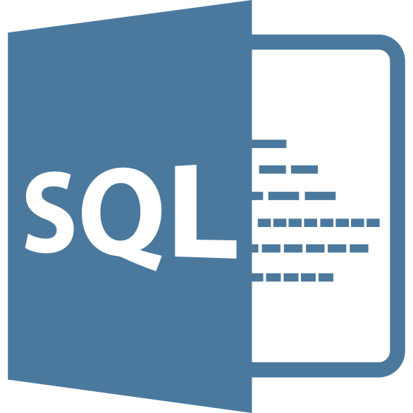

# VS Code SQL Notebook

Open SQL files in the VS Code Notebook interface. Execute query blocks
and view output interactively.

## Features

- Open any `.sql` file as a Notebook.
- Execute query blocks in the Notebook UI and view output.
- Configure database connections in the SQL Notebook sidepanel.
- Supports MySQL (Postgres support coming soon).
- (coming soon) Built-in typed autocomplete.

## Usage

Open any `.sql` file with the `Open With` menu option. Then, select the `SQL Notebook` format.

